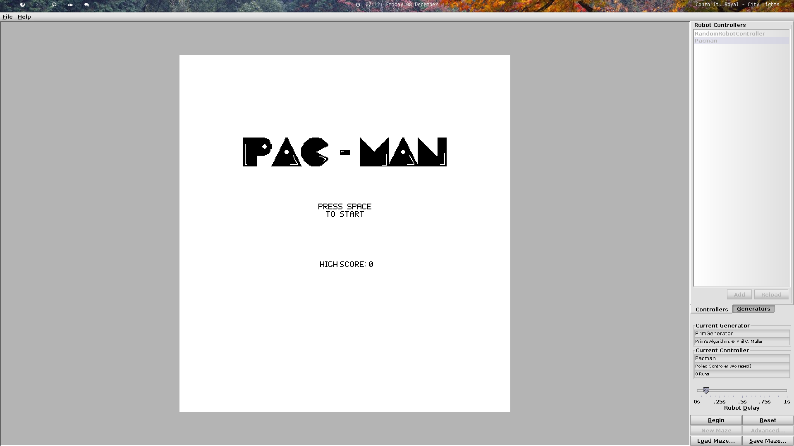
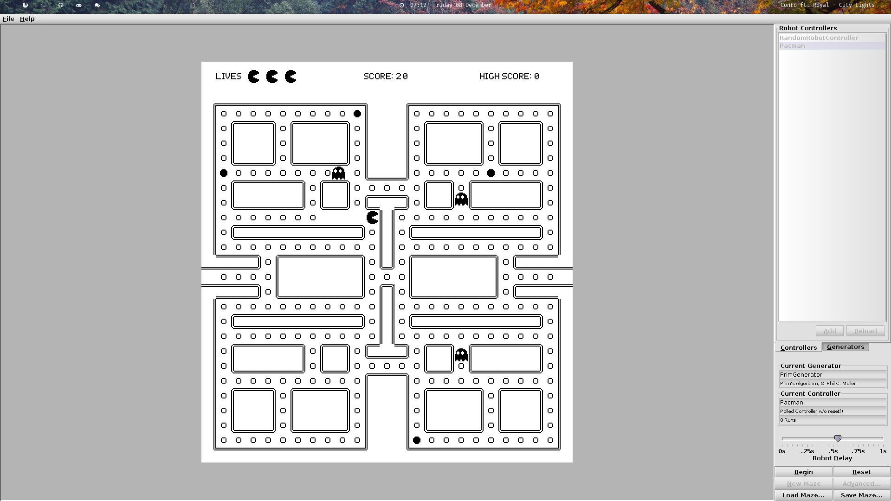

# Warwick University Pacman Game
A Pacman game to be played within the Warwick University maze coursework environment. This was a fun extension to the coursework, where we got to create anything we liked out of the maze environment - I chose to create Pacman.<br>
<br>
### Running
Unfortunately I am unable to supply the maze environemnt, because it is property of the University not mine. However, Computer Science Warwick students will have access to this on the CS118 web page. It is compiled in the same way as any other robot controller:<br>

```javac -cp maze-environemnt.jar:. Pacman.java```
<br><br>
Add the Pacman.class as a controller in the maze environment, and click 'Begin' once to start the game. You'll probably want to decrease the 'Robot Delay' slider to speed up the game a little bit (having it too high causes screen tearing sometimes). Focus the white popup window to control pacman, as this is what takes the input.

Use WASD to move pacman around!<br><br>

### Game Details
It is a fairly simple pacman clone. It features 3 different Ghost AIs, each inspired by a ghost in the original game; a high score counter; fruits you can eat to make the ghosts run away; and most other things you'd expect from a pacman clone.<br><br>

Regarding the code, for actual submission I concatenated all of the files into a single file, where the 'Pacman' class was the only one declared public. However, I have decided to keep them separated here since it makes for easy reading. Another thing to note is that if we had the ability to submit multiple files, a better way of doing things would be to store the sprites of the objects in a separate file and load them in at runtime.<br><br>

### Screenshots





